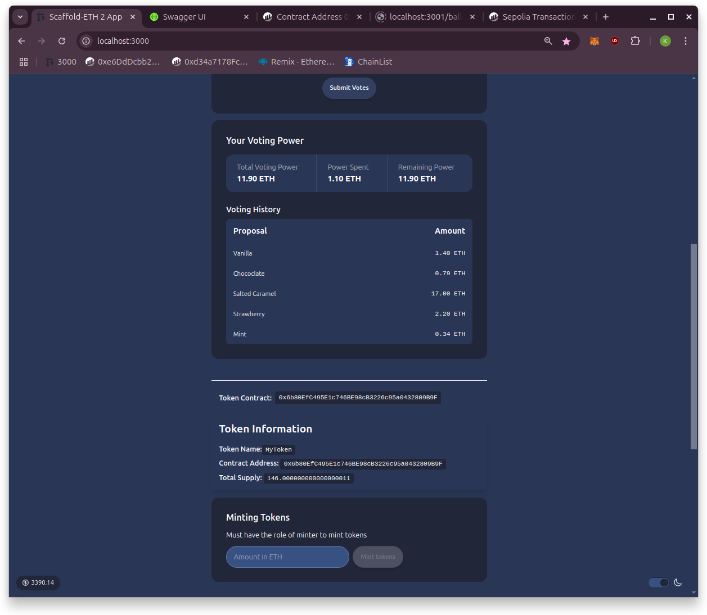

# Encode Solidity Bootcamp
#### HW #4

## Scope

✓ Create a voting dApp to cast votes, delegate and query results on chain\
✓ Request voting tokens to be minted using the API\
✓ (bonus) Store a list of recent votes in the backend and display that on frontend\
🚧 (bonus-work in progress) Use an oracle to fetch off-chain data\
&nbsp;&nbsp;&nbsp;&nbsp; Use an oracle to fetch information from a data source of your preference\
&nbsp;&nbsp;&nbsp;&nbsp;Use the data fetched to create the proposals in the constructor of the ballot

Voting dApp integration guidelines

✓ Build the frontend using Scaffold ETH 2 as a base\
✓ Build the backend using NestJS to provide the Mint method\
✓ Implement a single POST method\
✓ Request voting tokens from API\
✓ Use these tokens to interact with the tokenized ballot\
✓ All other interactions must be made directly on-chain

## Addresses on Sepolia

* Contract Address: `0x6b80EfC495E1c746BE98cB3226c95a0432809B9F`
* Ballot Contract: `0x71e4522a939e9f1d12419354d57a5585928511b9`

## Frontend

## Backend

## Note

I have made some extra functionality to sign directly on-chain from user's wallet without storing private keys in the `.env` file.  

Make sure you have a .env file that includes your RPC endpoints and private key on the server side.